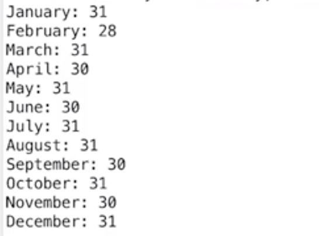
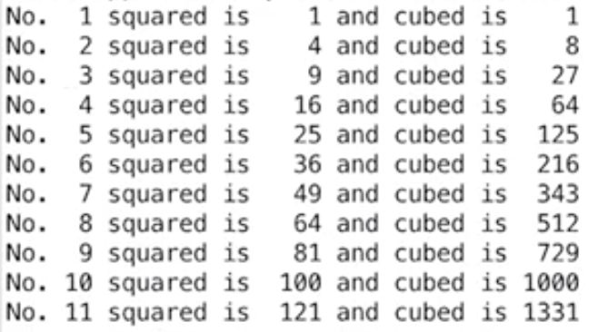
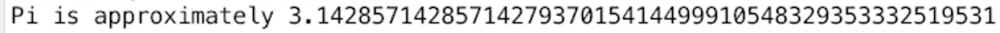
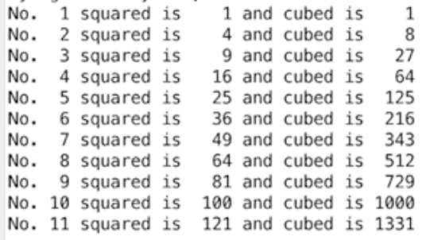

## **Functions and values**:
```
function(value)
```
`print` function displays its value on a screen. Example:
```
print('hello world')
print("hello world")
print("hello" + "world")
```

`input` function allow you to enter a text and save it as variable. Example:

```
name = input("Please enter your name: ")
```

## **Variables and its items**:
```
variable = item
```
```
variable = "world"
anothervar = "earth"
print(variable + ' ' + anothervar)
```

- Variables are case sensitive
- You can start variable name by `_` or `lowercase` or `uppercase`
- ...but you can use `numbers` like `45` in naming in the middle and the end
- Python doesn't have variable declarations (that's when you specify a type of a variable before using it)

## **Operators**: 

`>`, `<`, `*`, `+`, `-`

`%` (remainder) - `12 % 3 = 0`, because 12 can fit in 3 zero times. `3 % 12 = 4`.

`/` - returns result as a float!

`//` - returns result as an integer, a whole number

`in` - Returns `True` or `False` whether it finds that one item is a part of another or not. For example `print("fri" in "friday")` returns `True`.

`==` - checks if both values are the same

`=` - assigns a value

`!=` - checks whether values are not the same

`>=` - checks if value is greater than or the same

## **Expressions**:

`expression` in Python is everything that can be calculated to return a value. For example:
- `a + b` or `2 + 4`
- `12 + 3 / 3 -4 * 12` will result in `-35`. Why not `12`? Because of *operator precedence*. Multiplication and division have higher operator precedence, so it is calculated first. You can overcome this by using parenthesis `( )` or *variables*:

```
print((((12 + 3) / 3) -4) * 12)
```
```
a = 12 + 3
b = a / 3
c = b -4
print(c * 12)
```

## **Control characters**:

`\n` - new line (tripple quotes could also be used)

`\t` - tab

`\'` - ignore `'` as special character and print it as it is

## **Data types**:
- Numerics (eg. Integer, Float)
- Sequences (eg. String)
- Mappings
- Files
- Classes
- Instances
- Exceptions

In Python3, there is no longer `long` data type. `Int` data type behaves like `long` used to.

### **Basic data types examples**:

- Integer (whole number, eg. `1`). Significiantly faster than a float numbers.
- Float (real number, eg. `1.12`). Don't use it untill you really need it.
- Strings (Sequence of characters that you can put together)

## **Strings**:

`parrot = "Norwegian Blue"`

`print(parrot[3])` = `w`, because `w` is 4th character in the `Norwegian Blue` item (0, 1, 2, 3).

`print(parrot[0])` = `N`.

`print(parrot[-1])` = `e`, the last character of the string.

`print(parrot[0:6])` - called a *slice*. Printing range of characters, in this case `Norweg`. Printing `6` characters starting from position `0`.

`print(parrot[:6])` will result in the same `Norweg` while `print(parrot[6:])` will result in `ian Blue`.

`print(parrot[0:6:2])` = `Nre`. Starting from index position zero, extract all characters up to, but not including 6th in steps of two. In other words, print every 2 characters from range 0:6, not including 6th.
<br>--<br>
`number = 1,234,567,890,123,456,789`

`print(number[1::4])` will result in `,,,,,,`, so it's good in extracting portions of a numeric string
<br>--<br>
`numbers = "1, 2, 3, 4, 5, 6, 7, 8, 9"`

`print(numbers[0::3])` will result in printing `123456789`
<br>--<br>
`print("Hello " *5)` = `Hello Hello Hello Hello Hello `

`print("Hello " * (5 + 1))` = `Hello Hello Hello Hello Hello Hello `
<br>--<br>
`today = "friday"`

`print("day" in today)` = `True`


### **String formatting**:

You can't print string with a number by using `+` operator in Python, as Python will crash trying to add a number to a string. To do so, you can use `string function` also known as a `str method`:

`age = 24`

`print("My age is " + age)` will result in crash

`print("My age is " + str(age))` will work perfectly fine

`str(int)` will convert what is in the brackets into string.

### **Replacement fields** (introduced in Python 3):

`print("My age is {0} years".format(age))` prints `My age is 24 years`

`print("There are {0} days in {1} and {2}".format(31, "January", "March"))` prints `There are 31 days in January and March`

Example with using triple quotes, which allow you to work with print function on multiple lines for better view:
```
print("""January: {2}
February: {0}
March: {2}
April: {1}
May: {2}
June: {1}
July: {2}
August: {2}
September: {1}
October: {2}
November: {1}
December: {2}""".format(28, 30, 31))
```



`{0:2}` ensures that we take 1st item (item on position `0`) from a `.format` and reserve 2 spaces for the output, no matter how many characters it will actually give:
```
for i in range(1, 12):
    print("No. {0:2} squared is {1:4} and cubed is {2:4}".format(i, i ** 2, i ** 3))
```


`{0:<4}` will align its result to the left in its 4-character space:
```
for i in range(1, 12):
    print("No. {0:2} squared is {1:<4} and cubed is {2:<4}".format(i, i ** 2, i ** 3))
```

Below `{0:12.50f}` will ensure that we take 1st (and the only) item from `.format`, leave `12` spaces for the result in order to format it well, and print the result with `50` decimal points:
```print("Pi is approximately {0:12.50f}".format(22 / 7))
print("Pi is approximately {0:52.50f}".format(22 / 7))
print("Pi is approximately {0:62.50f}".format(22 / 7))
print("Pi is approximately {0:72.50f}".format(22 / 7))
```



We can also use `{}` to take items from `.format` in its original order:

`print("No. {} squared is {} and cubed is {:4}".format(i, i ** 2, i ** 3))`
<br><br>
### **Formatting operator** (deprecated in Python 3!):

`%d` stands for `integer`, `%f` stands for `float` and `%s` stands for `string`:
```
age = 24
print("My age is %d years" % age)

age = 24
print("My age is %d %s, %d %s" % (age, "years", 6, "months"))
```

--

`%2d` and `%4d` ensures proper formatting, leaving 2 and 4 spaces for the result no matter how many characters is actually used in the output. Similar to tabbing:
```
for i in range(1, 12):
    print("No. %2d squared is %4d and cubed is %4d" %(i, i ** 2, i ** 3))
```



`%12.50f` ensures 12 spaces for the result plus give us 50 decimal points of the result:
```
print("Pi is approximately %12.50f" % (22 / 7))
```

## **Blocks and indentention**

A Python program is constructed from code blocks. A block is a piece of Python program text that is executed as a unit.

The following are blocks: a module, a function body, and a class definition. Each command typed interactively is a block. A script file (a file given as standard input to the interpreter or specified as a command line argument to the interpreter) is a code block. A script command (a command specified on the interpreter command line with the -c option) is a code block.


Python programs get structured through indentation, i.e. code blocks are defined by their indentation.

All statements with the same distance to the right belong to the same block of code, i.e. the statements within a block line up vertically. The block ends at a line less indented or the end of the file. If a block has to be more deeply nested, it is simply indented further to the right.

## **Method vs Function**

### **Function**
A function is a block of code to carry out a specific task, will contain its own scope and is called by name. All functions may contain zero(no) arguments or more than one arguments. On exit, a function can or can not return one or more values.

Basic function syntax:
```
def functionName( arg1, arg2,….):
   …….
   # Function_body
   ……..
```

Let’s create our own (user), a very simple function called sum(user can give any name he wants)”. Function “sum” is having two arguments called num1 and num2 and will return the sum of the arguments passed to the function(sum). When we call the function (sum) with values(arguments) 5 and 6, it returns 11.

```
def sum(num1, num2):
   return (num1 + num2)
```

Output:
```
>>> sum(5,6)
11
```
So from above, we see the ‘return’ statement returns a value from python function.

The function allows us to implement code reusability. There are three kinds of functions −
1. Built-in functions ( As the name suggests, these functions come with the Python language, for example, help() to ask for any help, max()- to get maximum value, type()- to return the type of an object and many more.)
2. User-defined functions ( These are the functions that users create to help them, like the “sum” function we have created above).
3. Anonymous Functions (also called lambda functions and unlike normal function which is defined using def keyword are defined using lambda keyword).

### **Method (more about it later on - this is just to see the difference)**

A method in python is somewhat similar to a function, except it is associated with object/classes. Methods in python are very similar to functions except for two major differences.

The method is implicitly used for an object for which it is called.

The method is accessible to data that is contained within the class.

General Method Syntax:
```
class ClassName:
   def method_name():
      …………..
      # Method_body
      ………………
```

Let’s understand the method through one simple code:
```
class Pet(object):
   def my_method(self):
      print("I am a Cat")
cat = Pet()
cat.my_method()
```

Output:
```
I am a Cat
```
In the above code, we first defined class “Pet”. Then we created the object “cat” from this blueprint. Next, we call our custom method called my_method with the object(.i.e. cat).


**In Short, a method is a function which belongs to an object.**

### **Sources used in this file:**
- Learn Python Programming Masterclass (https://www.udemy.com/python-the-complete-python-developer-course/)
- Structuring with Indentation (https://www.python-course.eu/python3_blocks.php)
- Difference between Method and Function in Python (https://www.tutorialspoint.com/difference-between-method-and-function-in-python)