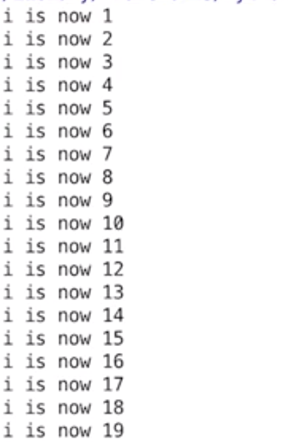
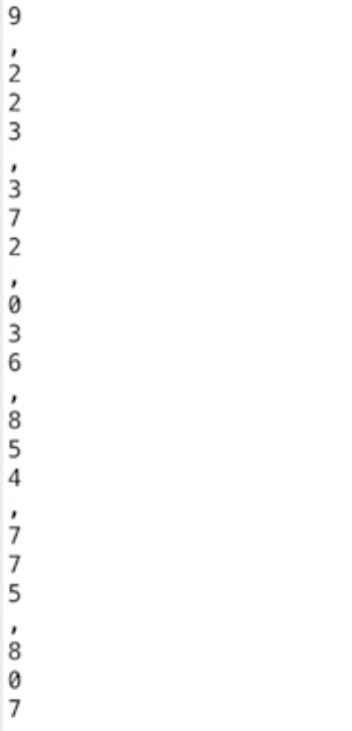

## **Program Flow**
### **Test conditions (if, elif, else)**
**Example**:
```
print("Please guess a number between 1 and 10: ")
guess = int((input))

if guess < 5:
    print("Please guess higher")
    guess = int(input())
    if guess == 5:
        print("Well done, you guessed it!)
    else:
        print("Sorry, you have not guessed correctly.")
elif guess > 5:
    print("Please guess lower")
    guess = int(input())
    if guess == 5:
        print("Well done, you guessed it!)
    else:
        print("Sorry, you have not guessed correctly.")
else:
    print("You got it first time")
```

However, this is not the best way to run this code, as we duplicate a couple of lines. Below example is way more efficient:

```
if guess != 5:
    if guess <5:
        print("Please guess higher")
    else:
        print("Please guess lower")
    
    guess = int(input())

    if guess == 5:
        print("Well done, you guessed it!)
    else:
        print("Sorry, you have not guessed correctly.")

else:
    print("You got it first time")
```

**Example 2 (and)**:

``age = input("How are you?")``

All below examples:

``if age >=16 and age <=65:``
    print ("Bla bla bla")

``if (age >=16) and (age <=65):``
    print ("Bla bla bla")

``if 15 < age < 66:``
    print ("Bla bla bla")

...will behave the same way.

`and` will check if both conditions are true. Python will stop checking as soon as it finds a contition that's false.

**Example 3 (or)**:

``if (age >=16) or (age <=65):``

`or` will check whether any of the condition is true. Python will stop checking as soon as it finds contition that's true.

**Booleans**:

Python doesn't have `Boolean` data type (which you can set to `True` or `False`), but it has two `constants` (`true` or `false`).

Any non-zero or non-empty values will evaluate to `true`.

```
x = "Something"
if x:
    print("This is true!")
```

In above case `x` variable is assigned so it resolves to true.

You can use the `bool()` funstion to check if its value returns true or false:

``bool(None)``, ``bool(0)``, ``bool("")``, ``bool([])`` will all return `False`.

**Example 4 (not)**:
``print(not True)`` will result in `False`.
```
if not(age < 18):
    print("You are old enough to vote.")
```

**Example 5 (in)**:
Useful in sequences (we will cover that later), but we can also treat string as a sequence of characters, so:
```
parrot = "Norwegian Blue"
letter = input("Enter a character: ")

if letter in parrot:
    print("Give me {} letter, please".format(letter))
else:
    print("I don't need that letter")
```

So what we technically do above is looking for a letter, and if that letter is one of the lettersc contained in the string `"Norwegian Blue"` - we print `Give me {} letter, please`. Otherwise we print `"I don't need that letter"`.

We can actually do exactly the same using `not`:

```
parrot = "Norwegian Blue"
letter = input("Enter a character: ")

if letter not in parrot:
    print("I don't need that letter")
else:
    print("Give me {} letter, please".format(letter))
```

### **For loops**
**Example**:

For loops takes range of values and assigns them one by one to a variable.
It then executes a block of code once for each value.
```
for i in range (1, 20):
    print("i is now {}".format(i))
```
Above example will print 19 lines with `i is now 1` to `i is now 19` messages:



Why not 20 lines? The last value specified is not included!

The naming convention for `for loop`s is to use names that will actually indicate what does it stand for. In the above example we used `i`, which is taken to be short for `index`.

**Example 2**:
```
number = "9,223,372,036,854,775,807"
for i in range(0, len(number)):
    print(number[i])
```

- `print(number[i])` is saying to print the character at position `i`.
- Function `len()` retirns the lenght of a string, so in this example that would be `25`.
- We access individual characters in a string starting from `0` to whatever the lenght is minus one, so in this case `24` (we already established that when we put a range in, we go up into one less than the final number). So we know that the `len(number)` is going to be correct (as there are 25 numbers when counting from 0 to 24).

Example 2 will result in:



